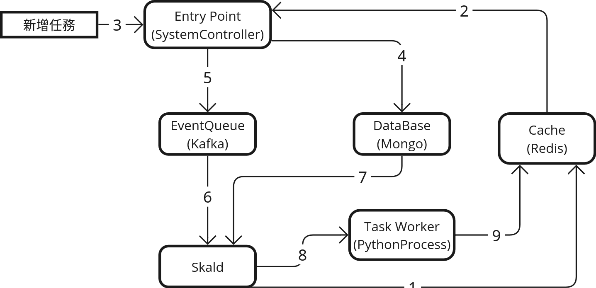

# 任務生命週期（Task Lifecycle）

Skalds 系統中的任務管理涵蓋「建立」、「更新」與「取消」三大核心流程。每個流程皆透過事件驅動機制，結合 Redis、Database 與 Event Queue，確保任務狀態的即時同步與高效調度。以下分別說明各流程細節與設計理念。

---

## 建立任務流程

1. Skald 啟動時，先向 Redis 登記自身 ID 與心跳訊號。
2. System Controller 持續與 Redis 同步目前可用的 Skald ID。
3. 接收外部新增任務請求（如 API 呼叫）。
4. 產生任務 ID，並將任務細節存入資料庫（Database）。
5. 以任務 ID 與 Skald ID 建立「新增任務事件」訊息，透過 EventBus 傳遞給指定 Skald。
6. Skald 接收與自身 ID 相符的事件。
7. Skald 依據任務 ID 從資料庫取得任務細節。
8. 根據任務細節建立 TaskWorker 實體。
9. TaskWorker 實體建立後，向 Redis 登記任務狀態、資訊與心跳。

---

## 更新任務流程

1. 接收外部更新任務請求。
2. 將指定任務細節更新於資料庫中。
3. 以任務 ID 與 Skald ID 建立「更新任務事件」訊息，透過 EventQueue 傳遞給指定 Skald。
4. Skald 接收與自身 ID 相符的事件。
5. Skald 依據任務 ID 從資料庫取得最新任務細節。
6. Skald 建立 TaskWorker 更新事件，並透過 EventQueue 傳遞給對應 TaskWorker。
7. TaskWorker 接收與自身任務 ID 相符的事件，並即時調整內部運作參數。

> 註：為保持單一入口（EntryPoint），所有任務事件皆由 Skald 統一處理，再轉發給內部 Worker，避免直接對 Worker 操作。

---

## 取消任務流程

1. 接收外部取消任務事件。
2. 刪除資料庫中的任務資料，或將任務狀態標記為已取消。
3. 以任務 ID 建立「取消任務事件」，透過 EventBus 廣播給所有 Skald。
4. Skald 查詢自身是否有對應任務 ID 的 TaskWorker，若有則將其關閉。
5. TaskWorker Process 接收作業系統事件（如 SIGTERM）。
6. Process 關閉前，將Heartbeat改為-2。

---

透過上述事件驅動的任務生命週期設計，Skalds 能夠實現高效、彈性且可擴展的分散式任務管理，並確保任務狀態與資源使用的即時同步與最佳化。